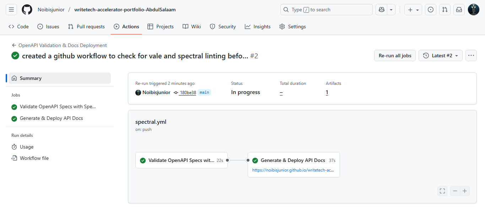

# API Documentation Automation

This folder contains the configuration and workflow setup for **automated validation and documentation** of the OpenAPI specifications.

## My setup includes:

- **GitHub Actions Workflow** that:
  - Validates OpenAPI 3.0 specifications with [Spectral](https://meta.stoplight.io/docs/spectral).
  - Generates static API reference documentation using [Redocly CLI](https://redocly.com/docs/cli/).
  - Deploys the generated documentation to **GitHub Pages** on every commit to the `main` branch.

- **Documentation Hosting**:  
  The generated docs are published automatically and can be accessed via [GitHub Pages](https://noibisjunior.github.io/writetech-accelerator-portfolio-AbdulSalaam/.)

- **Custom Landing Page**:  
  An `index.html` file was generated automatically in the workflow. It links to the API reference docs and the GitHub repository, and it was customized to use **Chimoney** as a case study.

---

## Rules and Standards Enforced

- **Spectral Linting**:
  - Ensures OpenAPI 3.0 specifications follow best practices.
  - Common enforced rules:
    - Every operation must have a `summary` and `description`.
    - Operation IDs must be unique.
    - Paths must begin with `/`.
    - Schema objects must have `type` defined.
    - Responses must include at least one `2xx` success code.

- **for Vale linting**:
  - Enforces consistent style and grammar in API descriptions and documentation.
  - Example standards:
    - Avoids weak words like “just” or “simple”.
    - Enforces sentence case for headings.
    - Consistent spelling (e.g., “email” not “e-mail”).
---

## Workflow execution

Below is a screenshot showing the GitHub Actions workflow in action. The automated pipeline validates the OpenAPI specification, generates documentation, and deploys it to GitHub Pages.



*The workflow successfully validates the OpenAPI spec with Spectral, builds documentation with Redocly, and deploys to GitHub Pages.*

---

## Challenges faced and solutions

Building an automated documentation pipeline involved overcoming several technical challenges. Here's how I resolved the key issues encountered during implementation.

### GitHub Pages deployment error

**Problem:** The initial workflow deployment failed with the following error:

```
Error: Get Pages site failed. Please verify that the repository has Pages enabled and has a valid source configured.
```

**Root cause:** GitHub Pages was not configured to use GitHub Actions as the deployment source.

**Solution:** 
1. Navigate to repository **Settings → Pages**.
2. Under "Build and deployment," change **Source** to **GitHub Actions**.
3. Re-run the workflow.

This configuration allows [GitHub Actions](https://docs.github.com/en/actions) workflows to deploy directly to Pages without requiring a separate branch.

### Spectral configuration

**Problem:** Understanding which Spectral rules to enable and how to create custom rules for API-specific requirements.

**Solution:** Started with the default `spectral:oas` ruleset and gradually added custom rules. Used the [Spectral documentation](https://meta.stoplight.io/docs/spectral/docs/getting-started/3-rulesets.md) to understand JSONPath selectors and rule functions.

### Vale style guide setup

**Problem:** Configuring Vale to use the correct style guides. The initial `.vale.ini` configuration had an incorrect path: `StylesPath = /.github/styles`.

**Solution:** Fixed the configuration by changing it to `StylesPath = .github/styles` (removing the leading slash). This resolved path resolution errors and allowed Vale to find the style guides correctly.

---

## Key learnings

This project provided hands-on experience with modern documentation automation practices and CI/CD workflows. Here are the key technical skills and insights gained.

### 1. CI/CD for documentation

I learned how to implement continuous integration and deployment pipelines specifically for documentation. [GitHub Actions](https://docs.github.com/en/actions) enables automated validation and deployment on every code change, ensuring documentation is always current and accurate.

**Key insight:** Automating documentation deployment eliminates manual publishing steps and reduces human error. Every commit triggers validation, ensuring broken documentation never reaches production.

### 2. Importance of standards and validation

[Spectral](https://stoplight.io/open-source/spectral) enforces OpenAPI specification quality, while [Vale](https://vale.sh/) ensures documentation readability and consistency. These tools catch issues that human reviewers might miss, such as:

- Missing operation descriptions
- Inconsistent terminology
- Grammar and style violations
- Incomplete API schemas

By automating these checks, documentation quality improves significantly while reducing review time.

### 3. OpenAPI specification best practices

Working with Spectral taught me the importance of well-structured API specifications. Complete, accurate OpenAPI documents enable:

- **Automated documentation generation** - Tools like [Redocly](https://redocly.com/) can build beautiful docs automatically
- **Code generation** - Client SDKs and server stubs can be generated from the spec
- **Contract testing** - Automated tests can validate that implementations match the specification
- **Interactive documentation** - Users can test API endpoints directly from the docs

### 4. Troubleshooting GitHub Actions

I gained practical experience debugging CI/CD workflows, particularly around:

- Permission configuration for GitHub Pages deployment
- Workflow dependencies and job ordering
- Artifact management and file path handling
- Environment variables and secrets management

Understanding GitHub Actions logs and error messages was crucial for identifying and fixing deployment issues quickly.

---

## Conclusion

This module demonstrates how automation transforms documentation from a manual, error-prone process into a reliable, efficient pipeline. By integrating [Spectral](https://stoplight.io/open-source/spectral), [Redocly](https://redocly.com/), [Vale](https://vale.sh/), and [GitHub Actions](https://github.com/features/actions), I created a system that ensures API documentation is always validated, consistently styled, and automatically deployed.

**Benefits of this automation approach:**

- **Quality assurance** - Automated validation catches errors before they reach users
- **Consistency** - Style guides enforce uniform terminology and formatting
- **Efficiency** - Automatic deployment eliminates manual publishing steps
- **Reliability** - Every change is tested and validated before deployment
- **Scalability** - The same pipeline can validate hundreds of API endpoints

This automation infrastructure reduces documentation maintenance overhead while improving quality, making it an essential practice for modern technical writing teams.

---